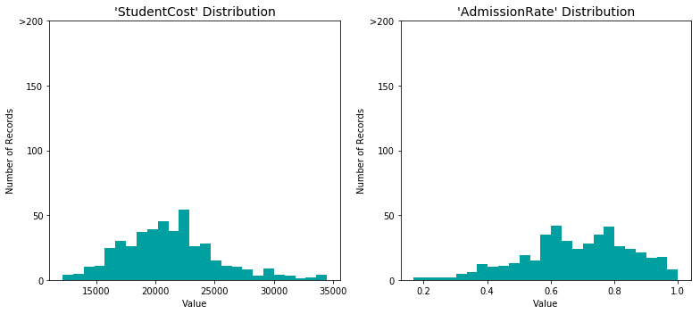

# Machine Learning Engineer Nanodegree
## Predict College Earning Potential
Aloysius Joseph  
July 15, 2018

## I. Definition

### Project Overview

   I propose to create a model for prediction for college selection based on earning potential. Students and parents have a tough time determining which colleges to apply. There are a lot of factors to consider and lots of conflicting information. Also there is lots of data available as well as lots of variables involved. But in general apart from SAT score and GPA that are used mainly for the admission process, several factors like University admission rate, public/private type of university etc., need to be considered.

Dataset: https://collegescorecard.ed.gov/data/Most-Recent-Cohorts-All-Data-Elements.csv

Documentation: https://collegescorecard.ed.gov/assets/FullDataDocumentation.pdf

Data Dictionary: https://collegescorecard.ed.gov/data/CollegeScorecardDataDictionary.xlsx

### Problem Statement

   Predict some of the major factors to be considered by a student when applying to Universities and help in the process of selecting Universities to apply.

   This is a classification problem. If the student is hoping to earn at least $50,000 10 years after graduation, which universities might he plan on applying (without taking the degree major into consideration). Which of these factors available about Universities will matter most: SAT scores, size (number of students), spending per student by university, type (public/private), cost for students, rate of admission, rate of completion and rate of retention. I plan to use Ensemble methods like Ada Bost, Random Forest and Gradient Boost and select the one providing better accuracy.

### Metrics

   Accuracy measures how often the classifier makes the correct prediction. It’s the ratio of the number of correct predictions to the total number of predictions.

   Precision is a ratio of true positives (students classified as earning >=50k, and who are actually earning that much) to all positives (all students classified as earning >=50k, irrespective of whether that was the correct classification).

    [True Positives/(True Positives + False Positives)]

   Recall(sensitivity) is a ratio of true positives(students classified as earning >=50k, and who are actually earning that much) to all the students who were actually earning >=50k.

    [True Positives/(True Positives + False Negatives)]

   For classification problems with distributions like in our case, precision and recall come in very handy. These two metrics can be combined to get the F1 score, which is weighted average of the precision and recall scores. This score can range from 0 to 1, with 1 being the best possible F1 score. The weight β can be increased if we want to have more emphasis on precision.

    [Fβ=(1+β2)⋅precision⋅recall/(β2⋅precision)+recall]

## II. Analysis

### Data Exploration

   The dataset is provided bu the US Department of Education (https://collegescorecard.ed.gov/). It is provided as a CSV file. 
The dataset consists of approximately 7593 data points, with each datapoint having 1825 features. 

   But for the purpose of this project 9 features have been selected with 1 target variable, as these seem to be more appropriate for the problem at hand.

**Features**
- `CONTROL`: integer : Collge type (1-Public/2&3-Private)
- `ADM_RATE`: float : Admission Rate
- `SATVRMID`: float: Average SAT score in English
- `SATMTMID`: float : Average SAT score in Math
- `COSTT4_A`: integer : Average cost to complete education
- `C150_4`: float: The degree completion rate
- `RET_FT4_POOLED`: float: Student retention rate
- `NUM4_PUB`: integer : Total number of enrolled students (indicates size)
- `INEXPFTE`: integer: Instructional expenditure per student

**Target Variable**
- `MN_EARN_WNE_INC2_P10`: float: Mean earnings of students 10 years after entry (<=50K, >50K)

#### Data Sample:

    <table border="1" class="dataframe">
      <thead>
        <tr style="text-align: right;">
          <th></th>
          <th>UNITID</th>
          <th>OPEID</th>
          <th>OPEID6</th>
          <th>INSTNM</th>
          <th>CITY</th>
          <th>STABBR</th>
          <th>ZIP</th>
          <th>ACCREDAGENCY</th>
          <th>INSTURL</th>
          <th>NPCURL</th>
          <th>...</th>
          <th>RET_FT4_POOLED_SUPP</th>
          <th>RET_FTL4_POOLED_SUPP</th>
          <th>RET_PT4_POOLED_SUPP</th>
          <th>RET_PTL4_POOLED_SUPP</th>
          <th>TRANS_4_POOLED</th>
          <th>TRANS_L4_POOLED</th>
          <th>DTRANS_4_POOLED</th>
          <th>DTRANS_L4_POOLED</th>
          <th>TRANS_4_POOLED_SUPP</th>
          <th>TRANS_L4_POOLED_SUPP</th>
        </tr>
      </thead>
      <tbody>
        <tr>
          <th>0</th>
          <td>100654</td>
          <td>100200</td>
          <td>1002</td>
          <td>Alabama A &amp; M University</td>
          <td>Normal</td>
          <td>AL</td>
          <td>35762</td>
          <td>Southern Association of Colleges and Schools C...</td>
          <td>www.aamu.edu/</td>
          <td>www2.aamu.edu/scripts/netpricecalc/npcalc.htm</td>
          <td>...</td>
          <td>0.61638362831858</td>
          <td>NaN</td>
          <td>0.41664791666666</td>
          <td>NaN</td>
          <td>0.200384</td>
          <td>NaN</td>
          <td>2086.0</td>
          <td>NaN</td>
          <td>0.20038350910834</td>
          <td>NaN</td>
        </tr>
        <tr>
          <th>1</th>
          <td>100663</td>
          <td>105200</td>
          <td>1052</td>
          <td>University of Alabama at Birmingham</td>
          <td>Birmingham</td>
          <td>AL</td>
          <td>35294-0110</td>
          <td>Southern Association of Colleges and Schools C...</td>
          <td>www.uab.edu</td>
          <td>uab.studentaidcalculator.com/survey.aspx</td>
          <td>...</td>
          <td>0.80765744125326</td>
          <td>NaN</td>
          <td>0.58823529411764</td>
          <td>NaN</td>
          <td>0.241619</td>
          <td>NaN</td>
          <td>2740.0</td>
          <td>NaN</td>
          <td>0.24161927007299</td>
          <td>NaN</td>
        </tr>
        <tr>
          <th>2</th>
          <td>100690</td>
          <td>2503400</td>
          <td>25034</td>
          <td>Amridge University</td>
          <td>Montgomery</td>
          <td>AL</td>
          <td>36117-3553</td>
          <td>Southern Association of Colleges and Schools C...</td>
          <td>www.amridgeuniversity.edu</td>
          <td>www2.amridgeuniversity.edu:9091/</td>
          <td>...</td>
          <td>PrivacySuppressed</td>
          <td>NaN</td>
          <td>PrivacySuppressed</td>
          <td>NaN</td>
          <td>0.111111</td>
          <td>NaN</td>
          <td>18.0</td>
          <td>NaN</td>
          <td>PrivacySuppressed</td>
          <td>NaN</td>
        </tr>
        <tr>
          <th>3</th>
          <td>100706</td>
          <td>105500</td>
          <td>1055</td>
          <td>University of Alabama in Huntsville</td>
          <td>Huntsville</td>
          <td>AL</td>
          <td>35899</td>
          <td>Southern Association of Colleges and Schools C...</td>
          <td>www.uah.edu</td>
          <td>finaid.uah.edu/</td>
          <td>...</td>
          <td>0.78698579881656</td>
          <td>NaN</td>
          <td>0.50876842105263</td>
          <td>NaN</td>
          <td>0.332677</td>
          <td>NaN</td>
          <td>1539.0</td>
          <td>NaN</td>
          <td>0.33267738791423</td>
          <td>NaN</td>
        </tr>
        <tr>
          <th>4</th>
          <td>100724</td>
          <td>100500</td>
          <td>1005</td>
          <td>Alabama State University</td>
          <td>Montgomery</td>
          <td>AL</td>
          <td>36104-0271</td>
          <td>Southern Association of Colleges and Schools C...</td>
          <td>www.alasu.edu</td>
          <td>www.alasu.edu/cost-aid/forms/calculator/index....</td>
          <td>...</td>
          <td>0.58470804331013</td>
          <td>NaN</td>
          <td>0.43181818181818</td>
          <td>NaN</td>
          <td>0.000000</td>
          <td>NaN</td>
          <td>2539.0</td>
          <td>NaN</td>
          <td>0</td>
          <td>NaN</td>
        </tr>
      </tbody>
    </table>

#### Data Statistics for selected features and target:

    <table border="1" class="dataframe">
      <thead>
        <tr style="text-align: right;">
          <th></th>
          <th>Earning</th>
          <th>NoStudents</th>
          <th>UnivSpending</th>
          <th>UnivType</th>
          <th>SATMath</th>
          <th>SATRead</th>
          <th>StudentCost</th>
          <th>AdmissionRate</th>
          <th>Completionrate</th>
          <th>RetentionRate</th>
        </tr>
      </thead>
      <tbody>
        <tr>
          <th>count</th>
          <td>448.000000</td>
          <td>448.000000</td>
          <td>448.000000</td>
          <td>448.0</td>
          <td>448.000000</td>
          <td>448.000000</td>
          <td>448.000000</td>
          <td>448.000000</td>
          <td>448.000000</td>
          <td>448.000000</td>
        </tr>
        <tr>
          <th>mean</th>
          <td>47238.392857</td>
          <td>1038.589286</td>
          <td>9676.296875</td>
          <td>1.0</td>
          <td>512.169643</td>
          <td>524.897321</td>
          <td>21166.167411</td>
          <td>0.682814</td>
          <td>0.511222</td>
          <td>0.768067</td>
        </tr>
        <tr>
          <th>std</th>
          <td>8848.756487</td>
          <td>805.681157</td>
          <td>4378.046492</td>
          <td>0.0</td>
          <td>55.772049</td>
          <td>62.385990</td>
          <td>4059.443911</td>
          <td>0.168965</td>
          <td>0.170033</td>
          <td>0.096141</td>
        </tr>
        <tr>
          <th>min</th>
          <td>29800.000000</td>
          <td>54.000000</td>
          <td>3121.000000</td>
          <td>1.0</td>
          <td>370.000000</td>
          <td>380.000000</td>
          <td>12151.000000</td>
          <td>0.168836</td>
          <td>0.108900</td>
          <td>0.488141</td>
        </tr>
        <tr>
          <th>25%</th>
          <td>41100.000000</td>
          <td>387.500000</td>
          <td>7039.750000</td>
          <td>1.0</td>
          <td>475.000000</td>
          <td>485.000000</td>
          <td>18452.500000</td>
          <td>0.582301</td>
          <td>0.397175</td>
          <td>0.703396</td>
        </tr>
        <tr>
          <th>50%</th>
          <td>46200.000000</td>
          <td>828.500000</td>
          <td>8591.000000</td>
          <td>1.0</td>
          <td>505.000000</td>
          <td>515.000000</td>
          <td>20949.500000</td>
          <td>0.690453</td>
          <td>0.493250</td>
          <td>0.766676</td>
        </tr>
        <tr>
          <th>75%</th>
          <td>51300.000000</td>
          <td>1476.750000</td>
          <td>10817.500000</td>
          <td>1.0</td>
          <td>545.250000</td>
          <td>555.000000</td>
          <td>23340.000000</td>
          <td>0.805161</td>
          <td>0.632250</td>
          <td>0.840963</td>
        </tr>
        <tr>
          <th>max</th>
          <td>95900.000000</td>
          <td>3975.000000</td>
          <td>43996.000000</td>
          <td>1.0</td>
          <td>680.000000</td>
          <td>745.000000</td>
          <td>34496.000000</td>
          <td>1.000000</td>
          <td>0.933000</td>
          <td>0.972121</td>
        </tr>
      </tbody>
    </table>

#### Data Sample for selected features and target:

    <table border="1" class="dataframe">
      <thead>
        <tr style="text-align: right;">
          <th></th>
          <th>Earning</th>
          <th>NoStudents</th>
          <th>UnivSpending</th>
          <th>UnivType</th>
          <th>SATMath</th>
          <th>SATRead</th>
          <th>StudentCost</th>
          <th>AdmissionRate</th>
          <th>Completionrate</th>
          <th>RetentionRate</th>
        </tr>
      </thead>
      <tbody>
        <tr>
          <th>0</th>
          <td>35500.0</td>
          <td>743.0</td>
          <td>7941.0</td>
          <td>1</td>
          <td>427.0</td>
          <td>420.0</td>
          <td>20809.0</td>
          <td>0.653841</td>
          <td>0.3081</td>
          <td>0.616384</td>
        </tr>
        <tr>
          <th>1</th>
          <td>45900.0</td>
          <td>955.0</td>
          <td>17548.0</td>
          <td>1</td>
          <td>575.0</td>
          <td>594.0</td>
          <td>22232.0</td>
          <td>0.604275</td>
          <td>0.5462</td>
          <td>0.807657</td>
        </tr>
        <tr>
          <th>3</th>
          <td>53400.0</td>
          <td>331.0</td>
          <td>10619.0</td>
          <td>1</td>
          <td>585.0</td>
          <td>615.0</td>
          <td>20999.0</td>
          <td>0.811971</td>
          <td>0.4935</td>
          <td>0.786986</td>
        </tr>
        <tr>
          <th>4</th>
          <td>30700.0</td>
          <td>570.0</td>
          <td>7742.0</td>
          <td>1</td>
          <td>410.0</td>
          <td>410.0</td>
          <td>18100.0</td>
          <td>0.463858</td>
          <td>0.2696</td>
          <td>0.584708</td>
        </tr>
        <tr>
          <th>5</th>
          <td>50100.0</td>
          <td>1282.0</td>
          <td>10312.0</td>
          <td>1</td>
          <td>545.0</td>
          <td>550.0</td>
          <td>27205.0</td>
          <td>0.535867</td>
          <td>0.6709</td>
          <td>0.865822</td>
        </tr>
      </tbody>
    </table>

    
    
#### Final DataSet details:
   Some of the data records did not have information for Earnings from Universities as it was privacy protedted. 
Hence had to pre-cleanup to remove those records.

    Total number of records: 448
    Individuals making more than $50,000: 150
    Individuals making at most $50,000: 298
    Percentage of individuals making more than $50,000: 33.48%

### Exploratory Visualization

The various distributions of the Features are displayed below:

#### Observations:
   The distributions for number of students does not have a normal distribution and skewed to left, as there are large universities and small private colleges. The disctribution for niversity spending on students is highly skewed to the left, as few famous universities have huge endowments while most others do not have that type of funding to spend on students.
Hence we may have to do log-transformation for these features so they do not negatively affect the performance of a learning algorithm.

   The distribution of other featues namely student cost, admission rate, completion rate, retention rate and SAT scores generally have somewhat normal distributions which might be good enough for this prediction.

   The distribution for the target Earning variable is shown below. It is skewed to the left as more students earn less than 50K as we saw in the statistics section above.

### Algorithms and Techniques

This is a Classification problem as we are trying to predict if sudents will earn at least 50K after 10 years of graduation based on a selected feature set. A decision Tree based model could be used as a starting point and Ensemble methods below can be attempted.

Based on http://scikit-learn.org/stable/tutorial/machine_learning_map/index.html and http://scikit-learn.org/stable/modules/ensemble.html I am thinking of using Ensemble Methods sequentail boosting (AdaBoost, Gradient Boost) and parallel bagging(RandomForest). This is because these classifiers make use of a base classifier (here DecisionTree as default) and improve on that. Error = Bias (where the algorithm cannot learn the target) + Variance (comes from sampling)

RandomForest (Bagging): It is based on fully grown decision trees (low bias, high variance). Bagging reduces error mainly by reducing variance (but not bias) by making the trees uncorrelated. The main weakness is it needs fully grown trees hence increases computational complexity of the model. Can be slow to score as the complexity increases. Its main strength is ability to handle outliers and noise. Also it works fast and off the shelf and typically avoids overfitting. This is a good model for the data as the dataset is not too large or complex and is generally considered a safe bet.

AdaBoost, GradientBoost (Boosting): Boosting is based on weak learners (high bias, low variance).Boosting reduces error mainly by reducing bias (and also to some extent variance), by aggregating the output from many models. Its main weakness is inability to handle outliers and noise and can overfit. It is complex to do tuning with several hyperparameters and finding a stopping point, But it performs well with higher complexities and is fast. They give better results but much harder to train. These are good models for the data as they are very powerful and as the data has been preprocessed for outliers. I guess GradientBoosting is used in most winning Kaggle competitions for a reason.

GradientBoost can be thought of a specific type of AdaptiveBoosting. The main difference is in AdaBoost boosting is done by increasing the weight of incorrect observations so subsequent iterations concentrate on those, whereas in GradientBoost gradient descent logic is used to minimize the loss function when adding trees. In a sense GradientBoost is generic enough to be used for more situations than AdaBoost.

I am thinking of starting with the default parameters for these algorithms, and then fine tune them later to see if they make a difference in accuracy scores.

### Benchmark
In this section, you will need to provide a clearly defined benchmark result or threshold for comparing across performances obtained by your solution. The reasoning behind the benchmark (in the case where it is not an established result) should be discussed. Questions to ask yourself when writing this section:
- _Has some result or value been provided that acts as a benchmark for measuring performance?_
- _Is it clear how this result or value was obtained (whether by data or by hypothesis)?_

Since there are numerous factors that could be used and hence not many standardised studies are available to provide an historic benchmark, I am using Naive predictor methodology where we assume everyone earns above $50,000, as a benchmark model and see
how the above Ensemble models perform.

The scores I got based on his method: 
   Naive Predictor: [Accuracy score: 0.3348, F-score: 0.3862]
   
   
## III. Methodology
_(approx. 3-5 pages)_

### Data Preprocessing
In this section, all of your preprocessing steps will need to be clearly documented, if any were necessary. From the previous section, any of the abnormalities or characteristics that you identified about the dataset will be addressed and corrected here. Questions to ask yourself when writing this section:
- _If the algorithms chosen require preprocessing steps like feature selection or feature transformations, have they been properly documented?_
- _Based on the **Data Exploration** section, if there were abnormalities or characteristics that needed to be addressed, have they been properly corrected?_
- _If no preprocessing is needed, has it been made clear why?_

### Implementation
In this section, the process for which metrics, algorithms, and techniques that you implemented for the given data will need to be clearly documented. It should be abundantly clear how the implementation was carried out, and discussion should be made regarding any complications that occurred during this process. Questions to ask yourself when writing this section:
- _Is it made clear how the algorithms and techniques were implemented with the given datasets or input data?_
- _Were there any complications with the original metrics or techniques that required changing prior to acquiring a solution?_
- _Was there any part of the coding process (e.g., writing complicated functions) that should be documented?_

### Refinement
In this section, you will need to discuss the process of improvement you made upon the algorithms and techniques you used in your implementation. For example, adjusting parameters for certain models to acquire improved solutions would fall under the refinement category. Your initial and final solutions should be reported, as well as any significant intermediate results as necessary. Questions to ask yourself when writing this section:
- _Has an initial solution been found and clearly reported?_
- _Is the process of improvement clearly documented, such as what techniques were used?_
- _Are intermediate and final solutions clearly reported as the process is improved?_

## IV. Results
_(approx. 2-3 pages)_

### Model Evaluation and Validation
In this section, the final model and any supporting qualities should be evaluated in detail. It should be clear how the final model was derived and why this model was chosen. In addition, some type of analysis should be used to validate the robustness of this model and its solution, such as manipulating the input data or environment to see how the model’s solution is affected (this is called sensitivity analysis). Questions to ask yourself when writing this section:
- _Is the final model reasonable and aligning with solution expectations? Are the final parameters of the model appropriate?_
- _Has the final model been tested with various inputs to evaluate whether the model generalizes well to unseen data?_
- _Is the model robust enough for the problem? Do small perturbations (changes) in training data or the input space greatly affect the results?_
- _Can results found from the model be trusted?_

### Justification
In this section, your model’s final solution and its results should be compared to the benchmark you established earlier in the project using some type of statistical analysis. You should also justify whether these results and the solution are significant enough to have solved the problem posed in the project. Questions to ask yourself when writing this section:
- _Are the final results found stronger than the benchmark result reported earlier?_
- _Have you thoroughly analyzed and discussed the final solution?_
- _Is the final solution significant enough to have solved the problem?_

## V. Conclusion
_(approx. 1-2 pages)_

### Free-Form Visualization
In this section, you will need to provide some form of visualization that emphasizes an important quality about the project. It is much more free-form, but should reasonably support a significant result or characteristic about the problem that you want to discuss. Questions to ask yourself when writing this section:
- _Have you visualized a relevant or important quality about the problem, dataset, input data, or results?_
- _Is the visualization thoroughly analyzed and discussed?_
- _If a plot is provided, are the axes, title, and datum clearly defined?_

### Reflection
In this section, you will summarize the entire end-to-end problem solution and discuss one or two particular aspects of the project you found interesting or difficult. You are expected to reflect on the project as a whole to show that you have a firm understanding of the entire process employed in your work. Questions to ask yourself when writing this section:
- _Have you thoroughly summarized the entire process you used for this project?_
- _Were there any interesting aspects of the project?_
- _Were there any difficult aspects of the project?_
- _Does the final model and solution fit your expectations for the problem, and should it be used in a general setting to solve these types of problems?_

### Improvement
In this section, you will need to provide discussion as to how one aspect of the implementation you designed could be improved. As an example, consider ways your implementation can be made more general, and what would need to be modified. You do not need to make this improvement, but the potential solutions resulting from these changes are considered and compared/contrasted to your current solution. Questions to ask yourself when writing this section:
- _Are there further improvements that could be made on the algorithms or techniques you used in this project?_
- _Were there algorithms or techniques you researched that you did not know how to implement, but would consider using if you knew how?_
- _If you used your final solution as the new benchmark, do you think an even better solution exists?_

-----------

**Before submitting, ask yourself. . .**

- Does the project report you’ve written follow a well-organized structure similar to that of the project template?
- Is each section (particularly **Analysis** and **Methodology**) written in a clear, concise and specific fashion? Are there any ambiguous terms or phrases that need clarification?
- Would the intended audience of your project be able to understand your analysis, methods, and results?
- Have you properly proof-read your project report to assure there are minimal grammatical and spelling mistakes?
- Are all the resources used for this project correctly cited and referenced?
- Is the code that implements your solution easily readable and properly commented?
- Does the code execute without error and produce results similar to those reported?
